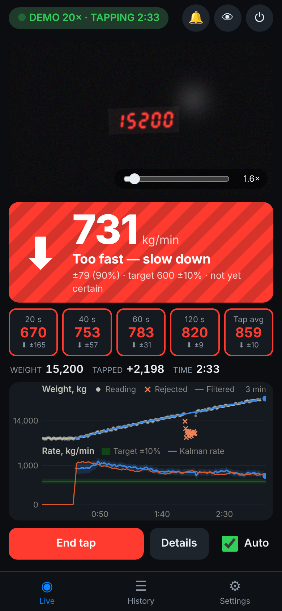
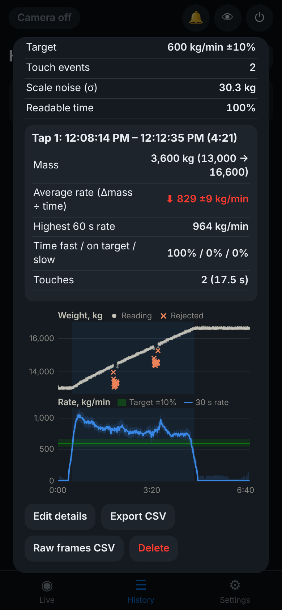

# Tap Rate: crane-scale mass-flow-rate app

An iPhone web app that reads the red seven-segment display of a crane scale with the camera, records the weight while a crucible is tapped, and shows the **tap rate in kg/min against a target (600 kg/min ±10%)**:

- **Red ⬇: too fast, slow down.**
- **Red ⬆: too slow, speed up.**
- **Green ↔: on target.**

It also shows 20/40/60/120-second and whole-tap averages. It ignores the scale jitter and 50 kg steps, rejects "touch" events (crucible resting on the cell), saves every tap, and exports CSV.

No App Store, no account, no server. It's a web page you add to the home screen. All data stays on the phone until you export it.

<p align="center"> </p>

---

## 1. Get it on your iPhone

**One-time setup (repo owner):** turn on GitHub Pages so the app has a web address.

1. On GitHub open **Settings → Pages**.
2. Under *Build and deployment*, set **Source** to **Deploy from a branch**.
3. Pick **Branch**: `main` (or this development branch, `claude/crane-scale-app-discovery-9gfo7l`) and folder **/ (root)**, then press **Save**.
4. After about a minute the app is live at **https://kaynejohnston.github.io/Crane-Scale-Mass-Flow-Rate-App/**.

**On each phone (you and your friends):**

1. Open that link in **Safari** (iPhone 13 or newer recommended; iOS 16.4+).
2. Tap **Share → Add to Home Screen**. It then opens full-screen like an app and works without signal once it has been loaded.
3. Open it, tap **Start camera**, and allow camera access.

**Try it without a crane:** Settings → **Run demo**, or open the link with `?demo=5` on the end. It plays a simulated tap with realistic noise, cathode touches and camera misreads.

---

## 2. Using it at the pot

1. **Aim and zoom.** Point at the scale display and pinch (or use the slider) until the red digits are clearly visible in the camera box. Drag to pan, double-tap to reset. A **green box** means the number is being read. **Amber** means digits were found but not read; the badge says why ("zoom in", "digits cut off", …). On Pro iPhones choose the *Telephoto* lens in Settings → Camera for 15 m work. The 4K camera setting gives the most pixels on the digits.
2. **Recording starts automatically** when the weight starts rising. It needs about 3 standard errors of evidence and more than 120 kg of rise, and the start time is back-dated to the true onset. Recording **stops automatically** when the weight hasn't risen by 100 kg for **2 minutes**, or when the display has been out of view for **45 s** (both adjustable). **Start tap now / End tap** override this, and the **Auto** box turns automation off.
3. **Read the big number.** It is the current tap rate (Kalman filter, explained below) with its 90% uncertainty:

   | Display | Meaning |
   |---|---|
   | **Red ⬇ "Too fast — slow down"** | rate above target + 10% |
   | **Red ⬆ "Too slow — speed up"** | rate below target − 10% |
   | **Green ↔ "On target"** | within ±10% |
   | **Striped** red or green | the point estimate says so, but the 90% interval still overlaps the band edge (*not yet certain*) |
   | Grey "Measuring…" | first ~12 s of a tap, while the estimate settles |
   | Grey "Flow dropping…" | rate collapsing (the tap is ending); no alarm unless it stays low for 15 s |
   | Grey "No flow" / "Display lost" | no metal going in / camera can't see the number |

   A beep sounds when it goes red. Falling tones mean slow down; rising tones mean speed up. It repeats every 20 s while red. Mute with 🔔.
4. **Tiles:** average rate over the last **20, 40, 60, 120 s** and the **whole tap so far**, each with a ± 90% range. Tiles fill in once enough of the window has elapsed.
5. **⚠ Touch** flashes while readings are impossibly low (crucible resting on the cathode). Those readings are excluded from every calculation.
6. **Details:** pot number(s), crucible ID, crew, operator, notes. These can be entered during the tap, or you're asked when it ends. Crew, crucible and operator are remembered.
7. **History:** every tap with mass, duration, average rate (green/red), peak 60 s rate, % of time fast / on target / slow, and touch count. **Export CSV** gives a summary (one row per tap). Each recording can export its full 0.5 s data or every raw camera frame. **Backup / Import** moves everything as JSON between phones.

**Several pots into one crucible:** if the crane moves to the next pot within 2 minutes, the recording continues. Each pot's tap is detected and reported separately (Tap 1, Tap 2, …).

**Recorded video instead of live:** film the display with the normal Camera app (zoomed in, phone steady), then use Settings → **Analyse a video…**. Frame the digits, then press **Analyse video**. It runs at about 2× real time. For the best footage:
- Zoom in until the display fills a third to a half of the picture's width, and lean the phone against something.
- Record in 4K if you can (Settings → Camera → Record Video).
- If the digits look white rather than red on the phone, press and hold on the display until *AE/AF LOCK* appears, then drag the ☀︎ slider down a little until they look red. Less glow means crisper digits.

**Screen:** the app keeps the screen awake while the camera runs (iOS stops the camera when the screen locks). If your iOS version doesn't, set *Settings → Display & Brightness → Auto-Lock* to a longer time.

**Battery.** The screen and the camera use most of the power, then the app's reading of the digits. **Low power mode** (🔋 on the live screen, or Settings → Battery) trims all three:
- The camera runs at 1080p and 15 frames a second instead of 4K at 30, an eighth of the pixels per second. With the camera's own zoom the digits keep their pixels; zoom in a little more if they look small.
- The app reads 3 frames a second instead of 10. At the target rate the display only changes every 5 seconds (50 kg steps at 600 kg/min), and in simulated taps the rate was just as accurate, even with a third of the frames unreadable.
- The camera picture dims while the display is being read: on the OLED screens of most iPhones, dark pixels use almost no power. The green box and the reading stay visible. Tap the picture to see it again for 15 s; it also comes back by itself whenever the digits can't be read.
- While the display is out of view, the app looks for it once a second.
- The numbers update once a second and the chart every 3 s.
- A recorded video is analysed at 3 frames per second of video, about three times faster.

In a desktop browser test, the app's own processing fell from 43% to 14% of one processor core. The camera and screen savings come on top and can only be measured on the phone. Other ways to make the battery last:
- Turn the screen brightness down as far as is comfortable; at full brightness the screen is usually the biggest drain.
- Switch on the iPhone's own Low Power Mode (Control Centre). It doesn't affect the app.
- Keep the phone out of the sun and away from the heat of the pot. A hot iPhone dims its screen and slows down to protect itself.
- Tap ⏻ to stop the camera when you're not measuring.
- For a whole shift, keep a battery pack or charging cable on the phone.

---

## 3. How the numbers are calculated (and why they're defensible)

### 3.1 From pixels to a weight reading
Each analysed frame (10 per second) goes through these steps:

1. A *redness* image is computed (R − max(G, B)), which rejects white glare, and the area is downscaled.
2. The display is located as a row of red blobs.
3. A crop is taken at full camera resolution, one digit-width wider than the digits on each side, and rescaled so digits are about 48 px tall.
4. The crop is thresholded halfway between background and segment brightness, which is the edge of a blurred stroke.
5. Hand-held tilt and the italic slant are removed by maximising the sharpness of the row and column projections.
6. The digit row is cut into digits by *segmentation by recognition*: every plausible way to cut it is scored by how well the pieces read as digits. Once the app has locked on to the readings it knows how many digits to expect. Before that, the plausible range (1,000–40,000 kg) allows 4 or 5.
7. The 7 segment regions of each digit are measured and matched to templates. A digit must win by a clear margin.

**Over-exposed displays.** Photographed from the floor, the real scale's digits are so bright that the camera records **white/cream lines inside a red glow**. To the redness image the digits are then holes. A second mode handles this. It reads the white cores that are enclosed by red glow on both sides; a light bezel or a yellow beam next to the display has red on one side at most. The mode switches itself off unless the cores really are white-hot: the green channel reaches about 220 on the real display and about 80 on a normally exposed one. Conversely, red mode refuses digits with white-hot cores and leaves them to this mode. In red terms it is the glow that is lit, and the glow around a "3" can fill in an "8". In *Auto*, the reader tries red digits, then over-exposed, then any bright digits, starting with whichever worked last.

**How much glow?** That depends on the exposure. In a 1080p video of the real scale (digits about 33 px tall) the glow is so heavy that at the usual threshold a "5" looks like a "9" and the digits run together; only the hottest part of each stroke still has its true shape. So when the usual threshold gives no reading, over-exposed digits are read again at higher thresholds: 60–90% of the way from the background to the brightest cores instead of 50%.
- A value counts only when two thresholds read it and none reads anything else. A misread caused by the glow, or by a dim stroke dropping out (a "4" whose left half fades looks like a "1"), comes and goes with the threshold; the true value stays.
- A "1" read above the usual threshold must also have the rest of its cell dark at the usual threshold.
- The thresholds that agreed are tried first on the next frame, so a steady view costs two extra reads, not seven.

**Framing.** The crop's size and scale come from the red area found, which may or may not take in the glow or the window around the digits, so they change with how tightly the display is framed (and the thresholds come from the background the crop holds). A crop of over-exposed digits that gave no reading is read once more with more background around it and its digits at the usual height. A second chance is also a second chance to misread, so there even a reading at the usual threshold needs a second threshold to agree.

Two more things the real display does:
- **A bright line under the digits.** The window's lower lip reflects the glow as a thin line touching every digit, which glues the whole number into one shape.
  - A row at the top or bottom edge of the digits holding an unbroken lit run longer than 1.5 digit heights must be such a line, because no digit has a bar that long.
  - Such rows are taken out before anything else, so the line can neither glue the digits together nor outweigh them when the reader finds the digit band.
  - Only rows that themselves hold such a run go, so the bars the line touches keep the rest of their pixels.
  - Taking a line out can hide part of a bar but never create one. Next to a removed line, a clearly lit top or bottom bar still counts, while a faint or missing one is ignored.
  - A "1" is refused if a line was just above the digits, since it could be a "7" whose top bar was hidden.
- **Digits that touch.** With bold, glowing strokes, a "2" and a "5" can run into each other. They are still cut apart by recognition. A digit's width is judged against a full digit cell (about 0.58 digit heights), not against whichever narrow "7" happens to stand alone.

A reading is accepted only if it lies in the plausible range and is a multiple of 50 kg, plus these checks:

- **No digit is ever silently dropped.**
  - Indicator LEDs and the decimal point are left out of the number only when they sit off the digit pitch. Every digit, "1" included, is right-aligned on that pitch.
  - A 4-digit reading such as 3,050 is accepted only if the cells on both sides of it are in view and empty, even of faint light. Numbers are right-aligned, so only the decimal point (low down) may sit to the right.
  - A digit clearly wider than a full digit cell is two digits glued together by glow. A "1" stuck to a "6" would turn 16,500 into 6,500, so the frame is refused.
- **Snapping to valid values.** The display can only show multiples of 50 kg, so the tens digit must be 0 or 5 and the last digit 0. When a digit is ambiguous on its own (a smudged "5" that could be a "3"), the reader takes the most likely *valid* number. It does this only if that number clearly beats every other valid number, and only to settle an ambiguity. If the last digit clearly looks like an 8, the picture can't be trusted (unlit segments showing through, say), so the frame is refused, not "corrected".
- The digits must sit on an evenly spaced pitch.
- A "1" must be a straight column with the rest of its cell empty. A "7" whose top bar is only partly visible is refused, not read as a "1".
- No digit may have half-lit segments.
- "Any bright digits" mode needs a clearer win.

**The reader prefers "no reading" to a wrong reading.** It was tested on 4,600 synthetic frames: blur, glow, glare, ghost segments, tilt, 12–70 px digits, indicator LEDs, clutter, and over-exposed displays modelled on photos of the real scale. It reads about 93% of normal frames, 88% of deliberately hard ones and 93% of over-exposed ones, with **no wrong values**. In 3,600 frames of simulated taps neither the single-frame reader nor the tracker gave a wrong value. On the real scale it reads 9 of 10 photos and 135 of the 150 frames of a 15 s, 1080p video (138 with the reading history); the rest are refused and none is misread. Crops of these photos and video frames are part of the tests. The steps below would also catch an isolated misread: the reading history (next section), 0.5 s medians and the Kalman gate.

### 3.2 Each reading is checked against the previous ones
Frames arrive about 10 times a second and the weight changes slowly. So each new frame is judged against what the last readings predict: the median of the last 7 accepted readings plus the current trend. The band around that prediction is sized from the jitter seen in recent frames (±3 to ±10 display steps).

- **Inside the band** → accepted.
- **Clear but far away** (e.g. 20050, 20050, 20050, 20050, then **10050**) → not believed on one frame, and never rewritten either. It must repeat on **3 consecutive frames** first. That covers a real drop when the crucible touches the cell, or a return to a recently seen level. A jump *above* anything seen recently is physically impossible for metal pouring in, so it must persist for **3 s**. The badge shows "Checking 10,050…" meanwhile.
- **Unclear frames** are those the reader couldn't decide on its own: a "7" that might be a "9", or a faint segment. For these the reader reports how well the glyphs fit every digit 0–9. The frame is resolved, shown as "≈20,050 kg", only if all of these hold:
  - the best-fitting value in the wider neighbourhood lies **inside** the band;
  - it fits clearly better than the runner-up (14600 vs 14800 is not guessed);
  - readings are steady;
  - no jump is being checked.
- After about 8 s without a reading (phone lowered), the history is discarded and the app locks on afresh from 2 consistent frames.

Each raw frame in the frames CSV records which of these happened. *Settings → Camera & vision* can switch the check off or change the 3 frames.

### 3.3 From frames to measurements
Frame readings are grouped into **0.5 s bins and the median is taken**. This removes single-frame misreads and LED multiplexing flicker. Each bin is one measurement: about 2 per second.

### 3.4 The big number: live tap rate (robust Kalman filter)
The crucible mass *m* and tap rate *q* follow a **local linear trend** model:

```
m(t+dt) = m(t) + q(t)·dt            mass grows at the tap rate
q(t+dt) = q(t) + w,  w ~ N(0, S·dt)   the tap rate can drift (operator adjusts the siphon)
reading = m + v,     v ~ N(0, R)      scale noise + 50 kg rounding
```

The Kalman filter for this model is the textbook optimal real-time estimator. It is exactly the causal form of a **cubic smoothing spline** through the weight curve, and the displayed rate is that spline's slope.

- **R (scale noise)** is estimated from the data itself. It uses the robust spread (MAD) of the second differences of recent readings, which cancels the trend. The floor is 50²/12, the variance of 50 kg rounding.
- **S (how fast the true rate can change)** is set by *Tap-rate variability* = 100 kg/min per minute. In simulation this setting gives the lowest error, and the **stated 90% interval contains the true rate about 90% of the time**, so the ± is honest.
- **The 600 kg/min target is *not* used as a prior.** That would pull estimates toward "on target" and make the tool unfair. The expected 300–1500 kg/min range is used only for plausibility checks. The rate must be ≥ 0 because metal can't flow out, and rates above 3000 kg/min are rejected as impossible.

**Is a Kalman filter the best choice?** It was compared with 20 other live estimators on 210 simulated taps of seven kinds ([tools/filter-bench](tools/filter-bench/README.md)). They include window regressions (least squares, Theil–Sen, LOESS, Savitzky–Golay), exponential smoothing (alpha-beta, Holt, Brown) and adaptive or robust Kalman variants (IMM, H-infinity, Student-t, a particle filter, a load-swing model). Each was tuned on separate taps. None was meaningfully better: the best gained 0.05 percentage points. The remaining error (about 6% RMS against the true rate at each moment) comes from the measurements, not the filter. The rate is the slope of a noisy weight shown in 50 kg steps, and the true rate keeps wandering while enough readings for a good slope come in.

### 3.5 Touches, bounces and misreads: the physics does the work
**Metal can't leave the crucible**, so a reading well below the mass already established is physically impossible. That means the crucible is resting on the cathode or cell. The established mass is the median of the last 10 s of accepted readings. A reading more than 3.5 σ below it is flagged as **touch** and excluded until the operator lifts the crucible.

Readings far above the prediction (spikes, bounces on lift-off, misreads) are excluded too, unless they persist, are self-consistent and are physically reachable. In that case the filter re-locks onto them. Moderate outliers are down-weighted (Huber). The filter re-initialises if it is clearly lagging a real change.

### 3.6 Window tiles (20/40/60/120 s)
Each tile is the **Theil–Sen slope**: the median of the slopes between all pairs of accepted readings in the window. It is a standard robust regression that is unaffected by up to about 29% outliers. Its ± uses a MAD noise estimate, inflated for autocorrelation, because crane swing makes neighbouring readings correlated.

The scale only moves in 50 kg steps, and at 600 kg/min that is one step every 5 s. So short windows are inherently imprecise. With typical noise (σ ≈ 40 kg) the 90% precision is roughly:

| window | 20 s | 40 s | 60 s | 120 s |
|---|---|---|---|---|
| ± (90%) | ~110 kg/min (18%) | ~40 (6%) | ~21 (3.5%) | ~7 (1%) |

That is why the main number uses the filter, which combines all the data optimally, and shows its own ±.

### 3.7 The tap average (saved per tap)
**Average rate = mass delivered ÷ tap duration.** This is the definition of an average flow rate, not a regression slope.

- **Start and end** of the tap are change-points found by a least-squares hinge fit (flat→rising, rising→flat).
- **Mass delivered** = median of the stable readings in the 20 s after the tap minus the median of the 20 s before. Crane swing averages out and touches are excluded.

The ± combines the uncertainty of both levels with ±1 s on each change-point. On simulated 6-minute taps the delivered mass comes out exact and the average is within about 0.5%.

**The rate through the tap** (the History chart, "time fast / on target / slow", the highest 60 s rate and the smoothed-rate column of the CSV) comes from a **two-pass smoother**. The live filter's model is run over the tap's readings forward and then backward, so the rate at each moment uses the readings after it as well as before. A live filter has to lag behind a changing rate; this curve doesn't. It is pinned to the level before the tap at its start and the level after it at its end, so it agrees with the tap's average rate. Touches and misreads that the live filter rejected stay out.

On 40 simulated taps:

| | Before (30 s slopes) | Two-pass smoother |
|---|---|---|
| Rate curve vs the true rate | 6.0% | 2.8% |
| Time fast / on target / slow | ±5.0 points | ±3.8 points |
| Highest 60 s rate | 1.3% | 0.7% |

Its ±90% band held the true rate 95% of the time. Taps saved with an earlier version are analysed again when History opens.

### 3.8 Colours
**Green** = inside target ±10%. **Red** = outside, with 1% hysteresis so it doesn't flicker. It is **solid** when the 90% interval is entirely on one side of the band edge, and **striped** when the evidence isn't conclusive yet. Beeps sound when red is certain, or after it has been "likely red" for 8 s.

---

## 4. Tuning the camera reading with your scale

The vision was developed on a realistic simulator, so real footage will improve it. Please send:

1. **A short video** (10–60 s) of the display filmed from where you'd stand, with the iPhone Camera app at the zoom you'd use. Ideally include one with glare.
2. A **screenshot with the debug panel on** (👁 button). It shows the crop, the threshold mask, digit height, slant and the reason a frame failed. **Save snapshot** exports a full-resolution frame.

Settings that may matter:

- **Digit colour:** *Auto* (recommended) tries red digits, then *over-exposed* (white digits in a red glow, which is how the real display photographs), then any bright digit.
- **Red strictness:** lower it if the digits look pink on screen in *Red digits* mode.
- **Plausible range:** 1,000–40,000 kg by default, so lighter loads (like the 3,050 kg in the test photos) read too. If you only ever measure taps, narrowing it to 10,000–30,000 makes the reader expect exactly 5 digits, which is slightly more robust.
- **Display shows:** choose this if the display shows tonnes with a decimal point.
- **Low power mode:** lighter camera stream, fewer readings and a dimmed picture; see *Battery* in section 2.

---

## 5. Data files

**`tap_…csv`**: one row per 0.5 s. The header lines (`#`) hold the session, pots, crucible, crew, target and per-tap results.

| column | meaning |
|---|---|
| `time_s`, `clock` | seconds since recording start, local time |
| `reading_kg`, `frames` | median of the camera readings in that 0.5 s, number of frames |
| `flag` | `ok`, `slow` (accepted, down-weighted), `touch`, `spike` (rejected), `pre` (before the tap) |
| `kalman_mass_kg`, `kalman_rate_kg_min`, `kalman_rate_ci90` | live filter state |
| `rate_20s_kg_min` … | window rates as shown on the tiles |
| `level_10s_kg`, `status` | robust current level; indicator state shown |

**`…_frames.csv`**: every analysed camera frame (time, value or blank, confidence, decision: `ok`, `prior`, `locked`, `jump-accepted`, `jump-pending`, `locking`, `unread`).

**`tap-rate-summary-….csv`**: one row per tap across all recordings (date, pots, crucible, crew, start, end, mass, average, ±, verdict, peak 60 s, % fast/ok/slow, touches).

---

## 6. Development

Plain ES modules with no build step and no dependencies. GitHub Pages serves the repo as-is.

```
index.html, css/, manifest.webmanifest, sw.js, icons/   the app shell (PWA, offline)
js/main.js                 controller: camera/video/demo -> reader -> engine -> UI
js/vision/sevenseg.js      seven-segment locator + reader (pure functions on RGBA)
js/vision/pipeline.js      two-stage frame reader, sampler-agnostic
js/vision/tracker.js       checks each reading against the previous ones (temporal prior)
js/analysis/engine.js      binning, robust Kalman, windows, flow on/off, auto start/stop
js/analysis/kalman.js      local linear trend Kalman filter and two-pass smoother
js/analysis/stats.js       Theil–Sen + SE, hinge change-points, robust noise
js/analysis/offline.js     per-tap results after a recording
js/analysis/sim.js         realistic tap simulator (noise, swing, touches, misreads)
js/vision/render7seg.js    synthetic seven-segment renderer (tests, demo, icons)
tests/                     node --test unit tests;  tests/e2e/ Playwright end-to-end
tests/fixtures/real/       crops of photos and video frames of the real scale (with the values shown)
tools/                     vision evaluation/debug, test video, icons, local server
```

```bash
npm test                              # unit tests (vision accuracy, statistics, engine on simulated taps)
node tools/vision-eval.mjs 500 --hard # Monte-Carlo read-rate / wrong-read check (single frames)
node tools/vision-eval.mjs 500 --hot  # ... on over-exposed displays (white cores in red glow, LEDs)
node tools/real-debug.mjs photo.jpg out/   # what the reader sees in a real photo (PNG, or JPEG via ffmpeg)
node tools/sequence-eval.mjs 8 --hard # frame sequences: independent reading vs. with the tracker
node tools/engine-run.mjs 3           # one simulated tap through the engine
node tools/filter-bench/run.mjs       # live-rate benchmark: 20 estimators vs the Kalman filter (~3 min)
node tests/e2e/smoke.mjs out/         # headless Chromium: demo -> history
node tests/e2e/camera.mjs out/        # fake camera stream -> live session
node tests/e2e/video.mjs out/         # synthetic video file -> analysis (needs ffmpeg)
node tools/serve.mjs 8080             # serve locally (camera needs https or localhost)
```
